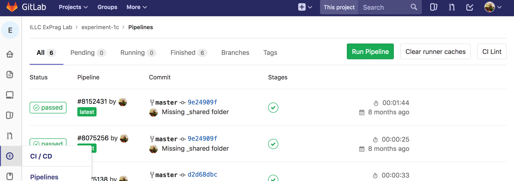

<!-- markdown-toc start - Don't edit this section. Run M-x markdown-toc-refresh-toc -->
**Table of Contents**

- [Server Documentation](#server-documentation)
    - [Required values from experiment submissions](#required-values-from-experiment-submissions)
    - [Retrieving experiment results](#retrieving-experiment-results)
- [Experiment Documentation](#experiment-documentation)
    - [Deploying experiments](#deploying-experiments)
    - [Deploying an experiment to Gitlab Pages](#deploying-an-experiment-to-gitlab-pages)
    - [Posting/Publishing experiments](#postingpublishing-experiments)
- [Additional Notes](#additional-notes)

<!-- markdown-toc end -->

This is a server backend to receive, store and retrieve online linguistics (pragmatics) experiments. This program was written for the research program [XPRAG.de](http://www.xprag.de/)

If you encountered any bugs during your experiments please [submit an issue](https://github.com/x-ji/ProComPrag/issues).

A live version of the server is deployed at https://procomprag.herokuapp.com

# Server Documentation
This section documents the server program.

## Required values from experiment submissions
The server expects to receive results from experiments which are structured similarly to the sample experiments provided under `doc/sample-experiments`, via HTTP POST. The experiment framework was developed by [Stanford CoCoLab](https://cocolab.stanford.edu/).

In addition to the original structure, **three extra values are needed** in the `exp.data` object to be submitted, as shown on lines 386 to 388 in `/doc/sample_experiments/italian_free_production/experiment/js/norming.js`:
- `author`: The author of this experiment
- `experiment_id`: The identifier (can be a string) that the author uses to name this experiment
- `description`: A brief description of this experiment

When an experiment is finished, instead of sending it with `mmturkey` to the interface provided by MTurk/using the original `turk.submit(exp.data)`, please POST the JSON to the following web address: `{SERVER_ADDRESS}/api/submit_experiment`, e.g. https://procomprag.herokuapp.com/api/submit_experiment

The following is an example for the `POST` call.

```javascript
$.ajax({
  type: 'POST',
  url: 'https://procomprag.herokuapp.com/api/submit_experiment',
  // url: 'http://localhost:4000/api/submit_experiment',
  crossDomain: true,
  data: exp.data,
  success: function(responseData, textStatus, jqXHR) {
    console.log(textStatus)
  },
  error: function(responseData,textStatus, errorThrown) {
    alert('Submission failed.');
  }
})
```

The reason for error would most likely be missing mandatory fields (i.e. `author`, `experiment_id`, `description`) in the JSON file.

Note that `crossDomain: true` is needed since the server domain will likely be different the domain where the experiment is presented to the participant.

## Retrieving experiment results
Just visit the server (e.g. at https://procomprag.herokuapp.com), enter the `experiment_id` and `author` originally contained within the JSON file, and hit "Submit". Authentication mechanisms might be added later, if necessary.

# Experiment Documentation
This section documents the experiments themselves, which should work independent of the backend (e.g. this program or the default backend provided by Amazon MTurk) used to receive their results.

## Deploying experiments
This program is intended to serve as the backend. An experiment is normally written as a set of static webpages to be hosted on a hosting provider (e.g. [Gitlab Pages](https://about.gitlab.com/features/pages/)) and loaded in the participant's browser. Currently, most experiments collected by this backend are conducted on the crowdsourcing platform [Prolific](https://www.prolific.ac/). However, there should be no restrictions on the way the experiment is run (via e.g. another crowdsourcing platform such as Amazon MTurk, or without any third-party platform at all).

Sample experiments based on the framework originally developed by [Stanford CoCoLab](https://cocolab.stanford.edu/) are provided under `doc/sample-experiments`. The experiment `1c` is for Amazon MTurk and the experiment `italian_free_production` is for Prolific.ac. The entry point for the experiments is the file `norming.html`.

## Deploying an experiment to Gitlab Pages
Currently all the experiments are deployed with Gitlab Pages, though other solutions might also be used, e.g. [Bitballon](https://www.bitballoon.com/).

The script `deploy.sh` prepares an experiment to be deployed to Gitlab Pages. You would still need to create a repository on Gitlab, init a git repo and push.

The following is a short description of the deployment process on Gitlab Pages:

1. Run the `deploy.sh` file, e.g. `bash deploy.sh italian_free_production ~/experiments`. Please ensure that the file `gitlab-ci-template.yml` also exists in the same folder.
2. Go to the folder containing the processed experiment: `cd ~/experiments/italian_free_production`
3. In your browser, create a gitlab repository, e.g. `test`
4. Initialize git repo: `git init`
5. Add the repository as a remote: `git remote add origin git@gitlab.com:exprag-lab/test.git`
6. Add all the files in the folder: `git add .`
7. Commit: `git commit -m "Initial commit"`
8. Push: `git push -u origin master`
9. Check whether the deployment task was successfully run on Gitlab:
    
10. The experiment should be available at user-name.gitlab.io/repo-name, e.g. https://exprag-lab.gitlab.io/test/

An example of deployed experiment may be found at https://exprag-lab.gitlab.io/experiment-1c/ (Pushed to the repository "experiment-1c" under the user "exprag-lab").

To write a new experiment, you may modify the files `norming.js` and `norming.html`. You may also include additional resources in the `experiment` folder, e.g. images to be used in the experiment. The file `css/local-style.css` can be used to define experiment-specific layouts. Due to differences in folder structures, the easiest way to update an experiment is to modify just the source files, and use the `deploy.sh` script to deploy the generated folder into actual Gitlab repos.

## Posting/Publishing experiments
After having successfully deployed an experiment to Gitlab Pages and tested it, you may want to post it on crowdsourcing platforms. To post an experiment on MTurk, you may use the script [Submiterator](https://github.com/feste/Submiterator) together with [MTurk command line tools](https://requester.mturk.com/developer/tools/clt), or you may do so manually.

To post an experiment on Prolific.ac, just follow the instructions given on their user interface and link to the experiment deployed on Gitlab Pages. Please remember to change the variable `exp.completionURL` in the file `norming.js` to match the Prolific completion URL for that particular experiment.

# Additional Notes
- The assumption on the server side when receiving the experiments is that each set of experiment results would have the same keys in the JSON file submitted and that each trial n an experiment would have the same keys in an object named `trials`. Violating this assumption might lead to failure in the CSV generation process. Look at `norming.js` files in the sample experiments for details.

  If new experiments are created by modifying the existing experiment examples, they should work fine.

- Please avoid using arrays to store the experiment results as much as possible. For example, if the participant is allowed to enter three answers on one trial, it would be better to store the three answers under three separate keys, instead of an array under one key.

  However, if an array is used regardless, its items will be separated by a `|` (pipe) in the retrieved CSV file.

- There is limited guarantee on DB security on Heroku's Hobby grade. The experiment authors are expected to take responsibility of the results. They should retrieve them and perform backups as soon as possible.

- This app is based on Phoenix Framework and written in Elixir. If you wish to modify the app, please look at the resources available at:
  - Official website: http://www.phoenixframework.org/
  - Guides: http://phoenixframework.org/docs/overview
  - Docs: https://hexdocs.pm/phoenix
  - Mailing list: http://groups.google.com/group/phoenix-talk
  - Source: https://github.com/phoenixframework/phoenix
